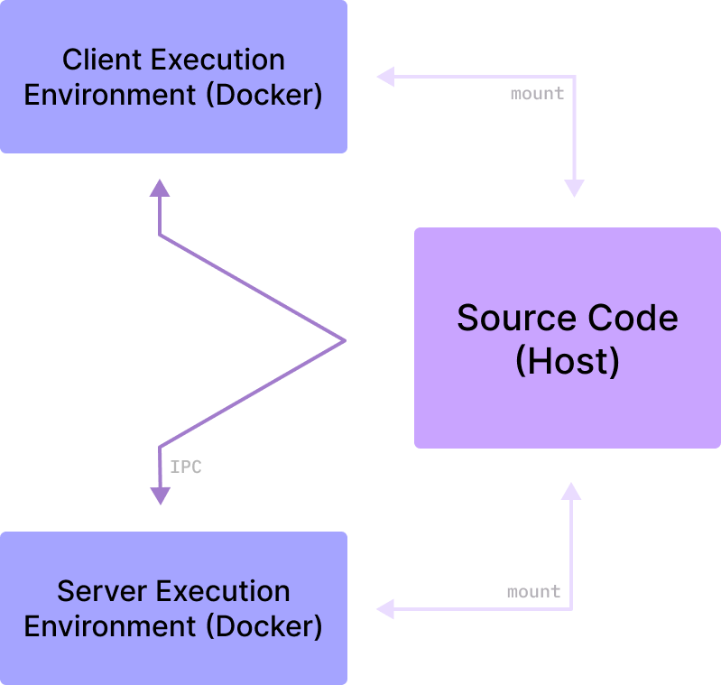
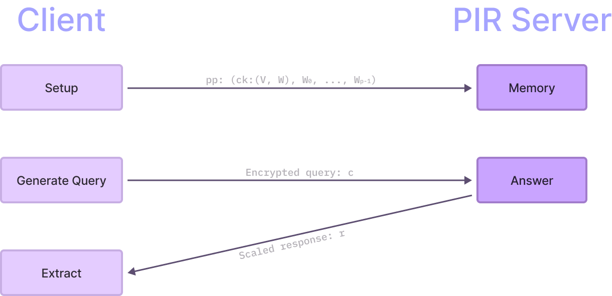

# Spiral 🍃

This repository contains the code
of [Spiral](https://github.com/menonsamir/spiral), which has been modified to
work alongside the Ethereum-PIR project.

## Fresh Ubuntu Installation

If you would like to bypass our build system and instead install on a fresh
Ubuntu 20.04 machine, please refer to these
[instructions](Fresh_Ubuntu_Instructions.md).

## Build System



Building Spiral can be complicated. To reduce the possibility for errors, I have
abstracted the setup process into individual containerised execution
environments. Each environment is based on an `Ubuntu` image, and contains all
the required dependencies to build, run and debug Spiral applications.

The source code of Spiral is hosted on your local machine, and is mounted
into `/tmp/Spiral` of the respective execution environment. This 'volume
mount' allows you to edit the source code on your local machine, and have the
changes reflect directly in the environment.

## Build Prerequisites

- An x86-64 machine is a must. The code uses Intel-based SIMD instructions to
  accelerate the query-database processing.
- [Docker](https://docs.docker.com/get-docker/) is required to build and run the
  execution environments.
- A native Linux environment is **strongly** preferred. This process has been
  tested on an [Arch Linux](https://archlinux.org/) machine.
- [CLion](https://www.jetbrains.com/clion/) is the recommended IDE for
  development.

### Building on ARM-based machines

Although an x86-64 machine is required, ARM machines (such as M1,2,3 Macs) might
be able to run Spiral using an x86_64 emulator. An emulator is very
expensive, so ensure you have adequate resources to run Spiral.

## Build Instructions

Clone the repository onto your local machine:

```bash
git clone https://github.com/kinda-raffy/Spiral.git Spiral
```

or

```bash
gh repo clone kinda-raffy/Spiral Spiral
```

Then, `cd` into the root of the repository:

```bash
cd Spiral
```

### Command Line

First create a single toolchain image using Docker:

```bash
docker build -t spiral_toolchain .
```

The Client and Server are separate applications that must be run adjacent to
one another. To do this, create two terminals and follow the instructions
for _both_ terminals unless otherwise specified.

1. Run the execution environment with the appropriate container settings.
    ```bash
    docker run -it \
    -u root \
    -v /HOST_PATH_TO_SPIRAL/Spiral:/tmp/Spiral \
    -v /HOST_PATH_TO_SPIRAL/Spiral/Process_Workspace:/home/ubuntu/Process_Workspace \
    --rm spiral_toolchain:latest \
    /bin/bash -c "cd /tmp/Spiral; exec bash"
   ```
   Ensure that the `HOST_PATH_TO_SPIRAL` is the path to the root of the
   repository on your local machine (Excluding the root project folder
   named `Spiral/`).
2. Decide on the database configuration you would like to use. Certain
   configurations, such as the database and element size, are required
   at compilation. This [section](#popular-configurations) has some popular
   configurations. You can also find a comprehensive list of configurations in
   the [configuration](./Documents/Configuration) directory. For this example,
   we will use a database of size
   `2^20` with elements of `32` bytes each. This configuration has the
   build folder name of `build_20_32`. If you do choose to use an alternative
   configuration,
   ensure you replace `build_20_32` with `build_<database_size>_<element_size>`.
3. Generate the build files. Note: replace `build_20_32` with the build folder
   name of your desired database configuration. This command can be ran in any
   of the two terminals.
   ```bash
   /usr/bin/cmake -DCMAKE_BUILD_TYPE=Release \
                  -DCMAKE_TOOLCHAIN_FILE=/home/ubuntu/vcpkg/scripts/buildsystems/vcpkg.cmake \
                  -DUSE_TIMERLOG=ON \
                  -DUSE_NATIVELOG=OFF \
                  -DUSE_LOG=ON \
                  -S /tmp/Spiral -B /tmp/Spiral/build_20_32  # Ensure you replace build_20_32 with your build folder name.
   ```
4. Build the Client and Server executables. Over here, you will need to specify
   a number of build parameters. These parameters are determined during
   automatic parameter selection, and can be found in the 'build
   options' of the [configuration](#popular-configurations) table. If you are
   using a configuration from [this](./Documents/Configuration) directory, then
   these options are listed under `Build Configuration:`.
    1. On the **client** terminal, specify the `Client` target.
       ```bash
       /usr/bin/cmake --build /tmp/Spiral/build_20_32 \
                      --target Client -v -j4 \
                      -- PARAMSET=PARAMS_DYNAMIC \
                                  TEXP=4 \
                                  TEXPRIGHT=56 \
                                  TCONV=4 \
                                  TGSW=4 \
                                  QPBITS=14 \
                                  PVALUE=4 \
                                  QNUMFIRST=1 \
                                  QNUMREST=0 \
                                  OUTN=2
       ```
    2. On the **server** terminal, specify the `Server` target.
       ```bash
       /usr/bin/cmake --build /tmp/Spiral/build_20_32 \
                      --target Server -v -j4 \
                      -- PARAMSET=PARAMS_DYNAMIC \
                                  TEXP=4 \
                                  TEXPRIGHT=56 \
                                  TCONV=4 \
                                  TGSW=4 \
                                  QPBITS=14 \
                                  PVALUE=4 \
                                  QNUMFIRST=1 \
                                  QNUMREST=0 \
                                  OUTN=2
       ```

### CLion

1. Create a toolchain image using Docker:
    ```bash
    docker build -t spiral_toolchain .
    ```
2. Open the root project in CLion.
3. Load the parent `./CMakeLists.txt` file as the CMake project.
4. Go to `File > Settings > Build, Execution, Deployment > Toolchains`, and
   add the built Docker image as a new toolchain called 'Docker_Spiral'.
5. CLion will automatically detect pre-configured build profiles and should
   build the project automatically.

### Popular Configurations

| Build Folder Name | Description                                                | Build Options                                                                                                        |
|-------------------|------------------------------------------------------------|----------------------------------------------------------------------------------------------------------------------|
| `build_20_256`    | Database size of `2^20` with elements of `256` bytes each. | `-- PARAMSET=PARAMS_DYNAMIC TEXP=8 TEXPRIGHT=56 TCONV=4 TGSW=9 QPBITS=21 PVALUE=256 QNUMFIRST=1 QNUMREST=0 OUTN=2`   |
| `build_10_32`     | Database size of `2^10` with elements of `32` bytes each.  | `-- PARAMSET=PARAMS_DYNAMIC TEXP=4 TEXPRIGHT=56 TCONV=4 TGSW=4 QPBITS=14 PVALUE=4 QNUMFIRST=1 QNUMREST=0 OUTN=2`     |
| `build_20_32`     | Database size of `2^20` with elements of `32` bytes each.  | `-- PARAMSET=PARAMS_DYNAMIC TEXP=4 TEXPRIGHT=56 TCONV=4 TGSW=5 QPBITS=16 PVALUE=16 QNUMFIRST=1 QNUMREST=0 OUTN=2`    |
| `build_30_32`     | Database size of `2^30` with elements of `32` bytes each.  | `-- PARAMSET=PARAMS_DYNAMIC TEXP=16 TEXPRIGHT=56 TCONV=4 TGSW=13 QPBITS=21 PVALUE=256 QNUMFIRST=1 QNUMREST=0 OUTN=2` |

For additional configurations, refer to
the [configuration](./Documents/Configuration) directory.

## Execution Instructions

### Command Line

These instructions assume you have the two terminals from
the [build process](#build-instructions) still open. Otherwise, re-run the
execution environments on two separate terminals.

The `client` and `server` executables require 3 arguments. The **first two** are
related to the number of dimensions and folding during query-data processing. To
put it simply, these will determine the number of 'actual' records in the
database. These arguments are selected during automatic parameter selection
which is done via the `select_params.py` script. For convenience, these two
arguments are listed in the [configuration](#popular-configurations) table or
under `Run Cofiguration:` in the [configuration](./Documents/Configuration)
directory. If you are using this directory, then only the
**first two** numbers after `./spiral` are relevant. For example, for the
file `20_32.config`, the run configuration lists the following:

```text
Run Configuration:
./spiral 7 6 7055 a
```

In this case, the first two numbers are `7` and `6`.

The third argument is the name of the data file that contains a list of hashes
in `json`. This is file name (`colorB_10.json`) and _not_ the file
path (`Database_Data/colorB_10.json`). These data files are located in the
`Database_Data` directory and a list of approapiate database sizes for each data
file can be found in the [meta file](Database/META). The client requires
the database file to verify the
hashes received from the server are correct.

Finally, the `client` and `server` executables must be executed with the same
arguments and the `client` should begin before the `server`.

1. On the **client** terminal, run the `Client` executable.
    ```bash
    /tmp/Spiral/build_20_32/Client/Client 7 6 <FileName>
    ```
2. On the **server** terminal, run the `Server` executable.
    ```bash
    /tmp/Spiral/build_20_32/PIR_Server/Server 7 6 <FileName>
    ```

### CLion

1. After building the CMake project, select the build option and the target you
   would like to run.
2. Run (Shift+F10) or Debug (Shift+F9) the selected target.

#### Mandatory Considerations

- The `Client` and `Server` executables must be run with the same parameters to
  ensure message verification is successful.
- The `Client` should always be ran before the `Server`. Otherwise, the
  receiving pipe on `Server` might hang.

## Client-Server Transactions

The `Client` and `Server` executables communicate with each other using OS
pipes.
The following diagram describes the transactions that occur between the two
executables.



## Issues

If you face any issues during the build or execution process, please open an
issue in this repository. Provide in-depth details of the following:

- Your environment (OS, CPU, RAM).
- All the commands you have tried to run and their ouputs to the lead up to this
  issue.
- The full error message you are receiving.
